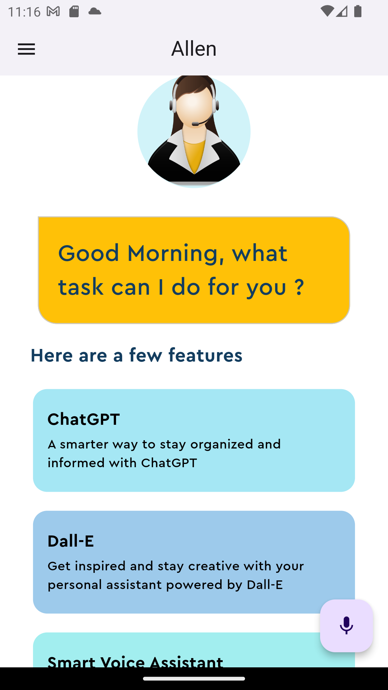

# Personal Virtual Voice Assistant App

## Description

Welcome to the Personal Virtual Voice Assistant app, a powerful and intelligent assistant powered by ChatGPT and Dall-E APIs using Flutter. This sophisticated voice assistant app is designed to perform a wide range of tasks with simple voice commands. It integrates ChatGPT, a state-of-the-art natural language processing model, and Dall-E, an AI image generation tool, to make your virtual assistant experience smarter and more responsive.

## Features

- ✨ Voice-Activated Commands: Communicate with your virtual assistant using natural voice commands.
- 🤖 ChatGPT Integration: Leverage the power of ChatGPT for natural language understanding and interaction.
- 🎨 Dall-E Image Generation: Generate images on-the-fly with Dall-E to enhance your assistant's responses.
- 📡 REST API Implementation: Learn how to integrate RESTful APIs for enhanced functionality.
- 🖼️ Beautiful Flutter UI: Create a stunning user interface with Flutter to provide a seamless user experience.

## Screenshots

## Getting Started

Follow these steps to get started with the Personal Virtual Voice Assistant app:

1. **Clone the Repository**: `git clone https://github.com/Arpitaagupta/Flutter-Voice-Assistant-App.git`
2. **Install Dependencies**: `flutter pub get`
3. **Run the App**: `flutter run`

## Usage

- Start the app and grant necessary permissions for voice recognition and camera access.
- Simply say "Hey Assistant" to activate the voice assistant.
- Speak your command, and watch as the assistant responds to your requests.
- Explore the app's features and have fun interacting with your virtual assistant.

## Contributing

Contributions are welcome! Feel free to open issues and pull requests to help improve this project. For major changes, please discuss them first in the [issues section](https://github.com/yourusername/your-repo/issues).

## License

This project is licensed under the MIT License - see the [LICENSE](LICENSE) file for details.

## Acknowledgments

- Special thanks to [OpenAI](https://openai.com) for providing the ChatGPT and Dall-E APIs.
- Thanks to the Flutter community for creating a versatile and beautiful UI framework.

## Contact

For any inquiries or suggestions, please contact [guptaarpita1105@gmail.com](mailto:guptaarpita1105@gmail.com).

